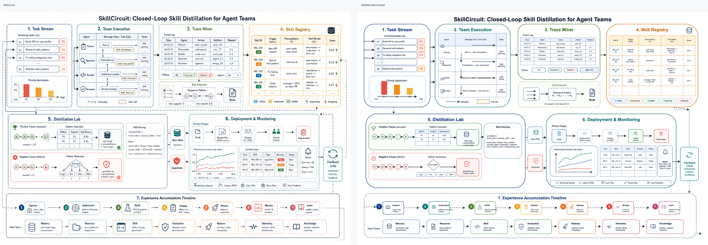
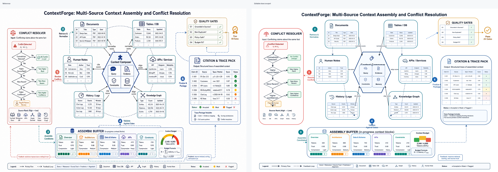

# Replicador de Figuras de Draw.io

[English](README.md) | [中文](README.zh-CN.md)

Convierte diagramas de referencia en archivos editables de draw.io / diagrams.net con agentes de IA.

La mayoría de las herramientas de diagramas de IA parten del texto. Esta habilidad parte de una imagen de referencia: una figura de un artículo académico, una captura de arquitectura, una foto de pizarra, un diagrama de flujo o una composición visual generada. El agente la reconstruye como XML nativo de draw.io con cajas, flechas, etiquetas, tablas y activos de iconos SVG editables y portátiles.



## Por Qué Existe Esto

La generación de imágenes con IA es útil para la exploración visual, pero generalmente produce imágenes estáticas. Los equipos necesitan diagramas que puedan inspeccionar, editar, versionar, localizar y mantener.

Esta habilidad proporciona al agente un flujo de trabajo disciplinado para la recreación fiel de figuras:

- inspeccionar las dimensiones, el diseño, los colores, la tipografía, las flechas y los componentes repetidos de la imagen de referencia
- decidir qué elementos deben ser primitivas de draw.io y cuáles necesitan activos SVG independientes
- generar XML `.drawio` basado en coordenadas en lugar de arrastrar manualmente
- incrustar activos SVG como URI de datos portátiles
- mantener el texto, las cajas, las flechas, las tablas y las etiquetas editables
- exportar una vista previa en PNG y compararla con la referencia antes de la entrega

## Ideal Para

- recreación de figuras de artículos académicos
- limpieza de diagramas de arquitectura de proyectos
- conversión de capturas de pantalla a diagramas editables
- reconstrucción de diagramas de flujo y procesos
- conversión de composiciones de imágenes generadas a draw.io mantenible
- extracción de iconos SVG reutilizables para diagramas

## No Ideal Para

- generación genérica de diagramas a partir de texto
- diagramas solo Mermaid
- incrustación de PNG de diapositivas completas
- trazado de logotipos de marca sin permiso
- vectorización perfecta a nivel de píxel de obras de arte que deberían permanecer como imágenes

## Instalación

Copia la carpeta de la habilidad en el directorio de habilidades de tu agente.

Para Codex:

```bash
mkdir -p ~/.codex/skills
cp -R skills/drawio-figure-replication ~/.codex/skills/
```

Para Claude Code:

```bash
mkdir -p ~/.claude/skills
cp -R skills/drawio-figure-replication ~/.claude/skills/
```

Reinicia o actualiza tu agente para que se vuelva a cargar la lista de habilidades.

## Herramientas Recomendadas

La habilidad puede guiar la generación de XML sin herramientas adicionales, pero la validación es mucho mejor con:

- diagrams.net Desktop / draw.io Desktop
- `xmllint`
- una herramienta de inspección de imágenes como PIL, ImageMagick o el visor de imágenes del agente

En macOS, la exportación de draw.io Desktop generalmente funciona con:

```bash
/Applications/draw.io.app/Contents/MacOS/draw.io -x -f png -o output.png input.drawio
```

## Ejemplo de Prompt

```text
Recrea esta figura de arquitectura de referencia como un draw.io editable.

Requisitos:
- conserva las regiones principales del diseño y el orden de lectura
- mantén el texto, las flechas, las cajas y las etiquetas editables
- crea activos SVG independientes solo para iconos reutilizables
- exporta una vista previa en PNG y compárala con la referencia
```

## Ejemplos

### SkillCircuit: Recreación Modular de Figuras Grandes


[SkillCircuit](examples/skillcircuit/README.md) demuestra el flujo de trabajo orientado a módulos para figuras densas. La referencia se divide en siete paneles, cada uno verificado con recortes de control de calidad a nivel de módulo antes de la integración final:

- Flujo de tareas
- Ejecución del equipo
- Minería de trazas
- Registro de habilidades
- Laboratorio de destilación
- Monitoreo de despliegue
- Línea de tiempo de acumulación de experiencia

Archivos: [draw.io](examples/skillcircuit/skillcircuit.drawio), [exportación PNG](examples/skillcircuit/skillcircuit.png), [comparación completa](examples/skillcircuit/comparison.png), [QA por módulo](examples/skillcircuit/module-qa-contact-sheet.png).

### ContextForge: Marco Académico de Alta Densidad



[ContextForge](examples/contextforge/README.md) es una recreación de una figura de marco académico de alta densidad:

- Ensamblaje de contexto multisource
- Flujo de trabajo de resolución de conflictos
- Puertas de calidad
- Empaquetado de citas y trazas
- Buffer de ensamblaje y ciclo de retroalimentación

Archivos: [draw.io](examples/contextforge/contextforge.drawio), [exportación PNG](examples/contextforge/contextforge.png), [comparación completa](examples/contextforge/comparison.png).

### Tablero de Conceptos Adicional

Consulta [examples/concept-board](examples/concept-board/README.md) para ver cuatro recreaciones adicionales de referencias generadas:

- Marco de Investigación
- Arquitectura de Plataforma de Agentes
- Pipeline de Modelos
- Flywheel de Experiencia

Cada ejemplo incluye un archivo `.drawio` editable, una vista previa exportada en PNG, activos SVG independientes y un script de regeneración.

## Contrato de Salida

Una ejecución exitosa crea una carpeta aislada cerca de la imagen de referencia:

```text
figure-name_recreated/
├── figure-name.drawio
├── figure-name.png
├── SVG_ASSETS.md
└── svg/
    ├── icon-1.svg
    └── icon-2.svg
```

El archivo `.drawio` no debe ser una simple captura de pantalla pegada. Debe contener celdas editables de draw.io para las formas principales, texto, conectores, tablas y etiquetas.

## Posicionamiento en el Mercado

El ecosistema de IA de draw.io avanza rápidamente. Las herramientas oficiales de MCP de draw.io y otras habilidades de la comunidad son fuertes para la generación de diagramas a partir de texto y el control del editor. Este proyecto es deliberadamente más específico:

> Imagen de referencia de entrada, recreación editable de draw.io de salida.

Consulta [research/market-scan.md](research/market-scan.md) para una comparación con las herramientas públicas existentes.

## Estructura del Repositorio

```text
.
├── README.md
├── README.zh-CN.md
├── LICENSE
├── MANIFEST.md
├── research/
│   └── market-scan.md
└── skills/
    └── drawio-figure-replication/
        ├── SKILL.md
        ├── agents/
        │   └── openai.yaml
        └── references/
            └── drawio-xml-patterns.md
```

## Licencia

MIT. Este proyecto no está afiliado a draw.io ni a diagrams.net.
